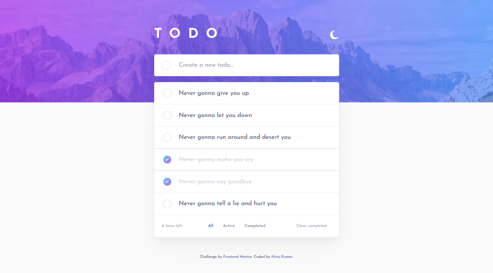
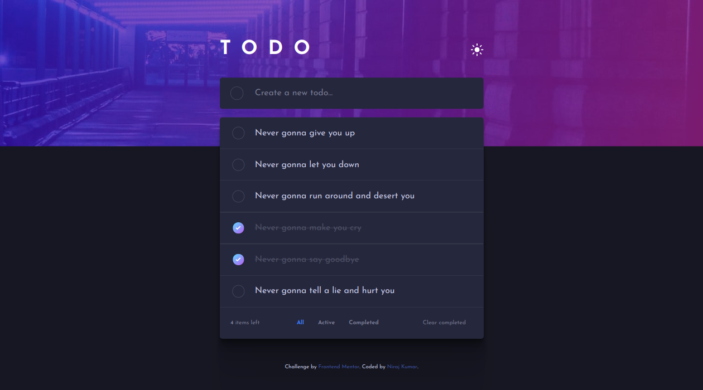
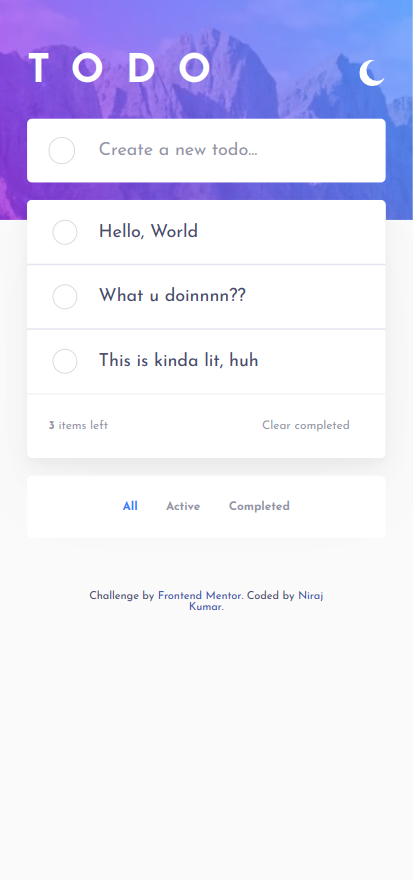
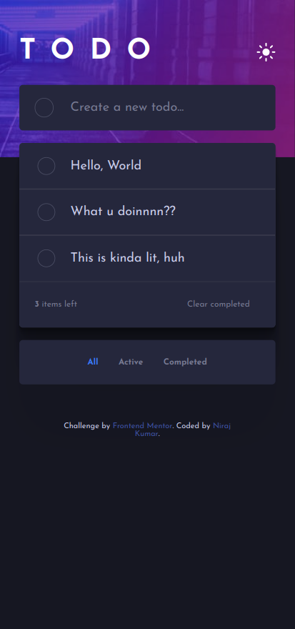

# Frontend Mentor - Todo app solution 😊

This is a solution to the [Todo app challenge on Frontend Mentor](https://www.frontendmentor.io/challenges/todo-app-Su1_KokOW).

## Table of contents

-   [Overview](#overview)
    -   [The challenge](#the-challenge)
    -   [Screenshot](#screenshot)
    -   [Links](#links)
-   [My process](#my-process)
    -   [Built with](#built-with)
    -   [What I learned](#what-i-learned)
    -   [Continued development](#continued-development)
    -   [Useful resources](#useful-resources)
-   [Author](#author)

## Overview

### The challenge

Users should be able to:

-   View the optimal layout for the app depending on their device's screen size
-   See hover states for all interactive elements on the page
-   Add new todos to the list
-   Mark todos as complete
-   Delete todos from the list
-   Filter by all/active/complete todos
-   Clear all completed todos
-   Toggle light and dark mode
<!-- -   **Bonus**: Drag and drop to reorder items on the list -->

### Screenshot

### Links

-   Solution URL: [My Solution on Frontend Mentor](https://your-solution-url.com)
-   Live Site URL: [pretty-todos](https://pretty-todos.netlify.app/)

## My process

### Built with

-   Semantic HTML5 markup
-   CSS custom properties
-   Flexbox
-   [React](https://reactjs.org/) - JS library

### What I learned

-   How to structure and organize a React application.
-   Working with state and managing component reactivity.
-   Handling user interactions and updating the UI accordingly.
-   Implementing CRUD (Create, Read, Update, Delete) functionality.
-   Using conditional rendering and filtering of tasks.
-   Basic form handling in React.

### Continued development

In future projects, I would like to focus on the following areas:

-   Implementing user authentication and user-specific todo lists.
-   Persisting data using a backend server or database.
-   Enhancing the UI with animations and transitions.
-   Improving accessibility and responsiveness for a better user experience.

### Useful resources

-   [React Documentation](https://reactjs.org/docs) - The official documentation for React.

## Author

-   Linked In - [@niraj-kumar-r](https://www.linkedin.com/in/niraj-kumar-r/)
-   Frontend Mentor - [@niraj-kumar-r](https://www.frontendmentor.io/profile/niraj-kumar-r)
-   Twitter - [@niraj_kumar_r](https://www.twitter.com/niraj_kumar_r)
